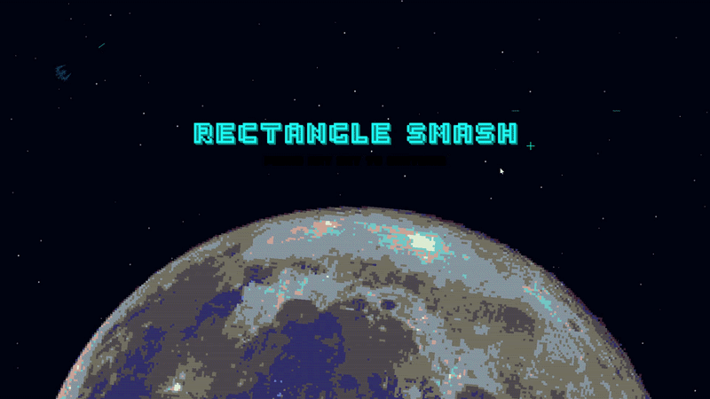

# 🚀 RECTANGLE SMASH: ULTIMATE EDITION

**Rectangle Smash** is an intense, high-octane 2D top-down arena shooter built from the ground up in **C++** using the **SFML 2.6** framework. It blends classic arcade "bullet-hell" action with modern roguelite progression, procedural effects, and deep ship customization.

  

---

## 🔥 FEATURES

### ⚔️ ADVANCED COMBAT MECHANICS
*   **Fluid Movement**: Velocity-based movement with dashing, ghosts, and screen-space wrapping.
*   **Weapon Heat System**: Manage your fire rate to prevent overheating, or enable **Auto-Fire** with a heat-penalty trade-off.
*   **Dash & I-Frames**: Execute tactical dashes to phase through projectiles.
*   **Graze Mechanic**: Flying dangerously close to bullets rewards you with points and ultimate charge.
*   **Ultimate Abilities**: Charge up your meter to unleash devastating ship-specific ultimates.
*   **Companion Drones**: Upgrade your arsenal with autonomous drones that track and eliminate targets.
*   **Screen-Clearing Bombs**: A tactical "panic button" to wipe the board of projectiles and deal massive damage.

### 🧬 ROGUELITE PROGRESSION
*   **Dynamic Perk System**: Choose from game-changing perks at the end of waves (Bouncy Lasers, Glass Cannon, Vampirism, etc.).
*   **The Shop**: Spend collected "Gears" mid-run on health, move speed, and fire rate upgrades.
*   **The Black Market**: Purchase permanent meta-progression upgrades like starting HP, damage multipliers, and permanent speed boosts.
*   **Ship Classes & Skins**: Choose between different ship archetypes (Tank, Speedster, balanced) and unlock custom skins.

### 💀 ELITE BOSS ENCOUNTERS

  
  

*   **Boss 1 (The Rectangle Overlord)**: A 2-phase tactical fight featuring radial bursts, teleporting minions, and a screen-tearing Mega-Beam.
*   **Boss 2 (Surt - The Geometry God)**: An epic 6-stage evolving encounter. Surt changes forms, patterns, and mechanics as you chip away at its health, culminating in a high-speed "Rage Mode" revival.

### 🎨 VISUAL & AUDIO POLISH
*   **Procedural Audio**: Many sound effects (explosions, dashes, hits) are generated via real-time math functions rather than static files, ensuring unique, crisp audio.
*   **Cinematic Effects**: Dynamic screen shake, hit-stop (time-freeze), chromatic aberration text, and slow-motion death cinematics.
*   **Hyperspace Parallax**: A multi-layered starfield background with parallax effects and a transitioning pixel-art Earth/Moon backdrop.

---

## 🎮 CONTROLS

| Action | Input |
| :--- | :--- |
| **Move** | `W`, `A`, `S`, `D` or `Arrow Keys` |
| **Aim** | `Mouse` |
| **Primary Fire** | `Left Click` |
| **Homing Missiles** | `Right Click` |
| **Dash** | `Spacebar` |
| **Tactical Bomb** | `Left Shift` / `F2` |
| **Pause / Menu** | `ESC` |

---

## ⚙️ TECHNICAL OVERVIEW

### TECH STACK
*   **Language**: C++17
*   **Framework**: SFML 2.6.x (Graphics, Audio, Windowing, System)
*   **Platform**: Windows (Win32 API integration for debug logging)
*   **Build System**: Visual Studio 2022

### PROJECT ARCHITECTURE
*   **`game` Class**: The central engine managing state transitions, subsystem updates, and rendering.
*   **Subsystem Separation**:
    *   `game_init.cpp`: Handles resource loading and procedural audio generation.
    *   `game_update.cpp`: Contains modular update logic for 15+ game states.
    *   `game_render.cpp`: Implements custom rendering pipelines (glow text, UI panels, particle systems).
    *   `game_spawn.cpp`: Manages entity pooling and wave logic.
*   **Boss Logic**: Decoupled `Boss` and `Boss2` classes with internal state machines for phase transitions.

---

## 🚀 GETTING STARTED

### Prerequisites
*   **Visual Studio 2022** with "Desktop development with C++" workload.
*   **SFML 2.6.x**: The project includes the necessary headers and libraries in the `External/SFML` directory.

### Build Instructions
1. Clone the repository.
2. Open `RectangleSmash.sln` in Visual Studio.
3. Select **x64** platform and **Release** (recommended) or **Debug** configuration.
4. Press **F5** to compile and run.

> **Note**: All assets (textures, fonts, sounds) must be present in the `RectangleSmash/` directory relative to the executable for the game to load correctly.

---

## 📁 FILE STRUCTURE
*   `RectangleSmash/`: Main source code directory.
*   `assests/`: Game textures and background music.
*   `fonts/`: TrueType and OpenType fonts.
*   `External/SFML/`: Local SFML binaries and headers.
